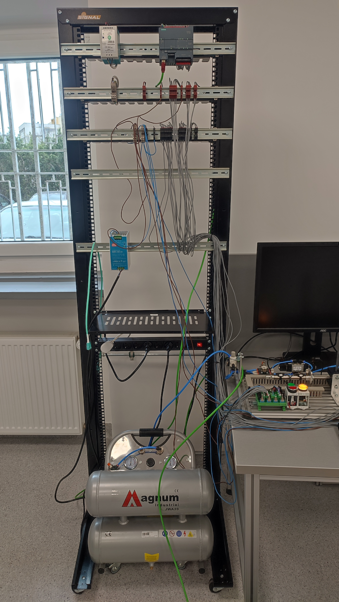
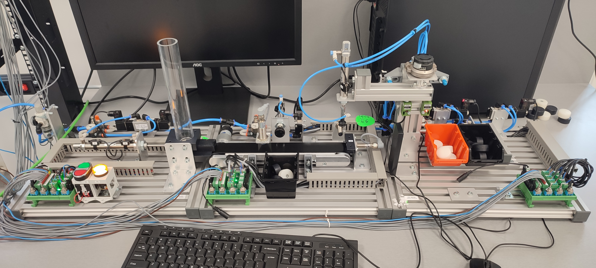

# 🏭 Pneumatic Cylinder Sorting System – Siemens S7-1200 (TIA Portal, LAD)

This project is a **pneumatic cylinder sorting station** built with Siemens **S7-1200 PLC** and programmed in **TIA Portal** using **Ladder Logic (LAD)**. The system handles a continuous flow of plastic-encased cylinders, some of which contain metal. Based on sensor readings, the system sorts and directs these cylinders to the appropriate destination truck using a series of pneumatic actuators, sensors, and logic control.

---

## 📸 Demo and Media

- 
- 

🎥 [Watch the system in action](demo/demonstation.mp4)

**For more demonstrations and media, please open the `demo` folder.** There are additional videos available to showcase the system's functionality.

---

## 🛠️ System Features

- **Feeder Mechanism**: A pressure-based actuator feeds stacked cylinders onto the conveyor.
- **Metal Detection**: Metal sensor above the conveyor detects if the current cylinder contains metal.
- **Sorting Logic**: After a configurable delay, cylinders with metal are pushed off the conveyor.
- **Redundancy Tracking**: Up to 6 timestamped entries are maintained to handle conveyor stops and queued metal cylinders.
- **End of Line Detection**:
  - **Presence Sensor**: Stops the conveyor when a cylinder reaches the end.
  - **Color Sensor**: Detects if the cylinder is white to determine which truck it should be routed to.
- **Pneumatic Arm**: 
  - Moves between conveyor and destination truck.
  - Can lower and use suction to lift and release cylinders.
  - Uses sensors for accurate position detection.
- **Control Panel**:
  - Start and stop buttons.
  - Green and yellow signal lights for status indication.

---

## 🔧 Tags Overview

Here are key I/O tags used in the PLC program:

### 🟢 Inputs

| Tag | Description |
|-----|-------------|
| `S1_Start` | Start button |
| `S2_Stop` | Stop button |
| `B1_FeederRetracted` | Feeder retracted sensor |
| `B2_FeederExtended` | Feeder extended sensor |
| `B3_PusherRetracted` | Pusher retracted sensor |
| `B4_MetalSensor` | Metal detection sensor |
| `B5_ColorSensor_IsWhite` | Color sensor detects white |
| `B6_AtConveyorEnd` | Cylinder reached end of conveyor |
| `B7_ArmOverConveyor` | Arm is positioned over conveyor |
| `B8_ArmOverTruck` | Arm is positioned over truck |
| `B9_ArmIsDown` | Arm is in the down position |
| `B10_WhiteTruckActive` | White truck selected as target |

### 🔴 Outputs

| Tag | Description |
|-----|-------------|
| `P1_LightGreen` | Green indicator light |
| `P2_LightYellow` | Yellow indicator light |
| `Y1A_FeederExtend` | Extend feeder actuator |
| `Y1B_FeederRetract` | Retract feeder actuator |
| `M1_ConveyorMove` | Conveyor motor on |
| `Y2_PusherExtend` | Extend metal pusher actuator |
| `Y4_LowerArm` | Lower the suction arm |
| `Y5_GripperPressureOn` | Activate suction |
| `Y6_ArmFromTruckToConveyor` | Move arm between positions |
| `Y3_EnableBlackTruck` | Activate black truck path |

---

## 📂 Project Structure

### DB (Data Blocks)
- DB_ArmSafeStopSteps (DB5)
- DB_ItemTracking (DB6)
- DB_Settings (DB2)

### FC (Function Blocks)
- FC_ArmSafeStop (FC5)
- FC_Conveyor (FC1)
- FC_Feeder (FC2)
- FC_PickAndPlace (FC3)
- FC_Truck (FC4)

### OB (Organization Blocks)
- Main (OB1)

### PLC Tags
- Default tag table
- ArmInput
- ArmOutput
- ConveyorInput
- ConveyorOutput
- OperatorPanel

## 🚀 Getting Started

To simulate or deploy this project:

1. Open the `.ap19` project file in **TIA Portal** (tested with TIA Portal V19+).
2. Connect to a Siemens **S7-1200 PLC** (compatible CPU recommended: e.g., CPU 1214C).
3. Ensure all I/O addresses are correctly mapped to your hardware setup.
4. Run the program and test the workflow using the demo workstation.

---

## 📌 Notes

- Actuators rely on an external **compressed air source**.
- Make sure safety mechanisms are in place before running the physical system.
- The system can be extended with more sensors or vision systems for advanced sorting.

---

## 📧 Contact / Feedback

Feel free to open an [issue](https://github.com/Wisoxx/conveyor-push-pull-sort/issues) if you have questions or suggestions!